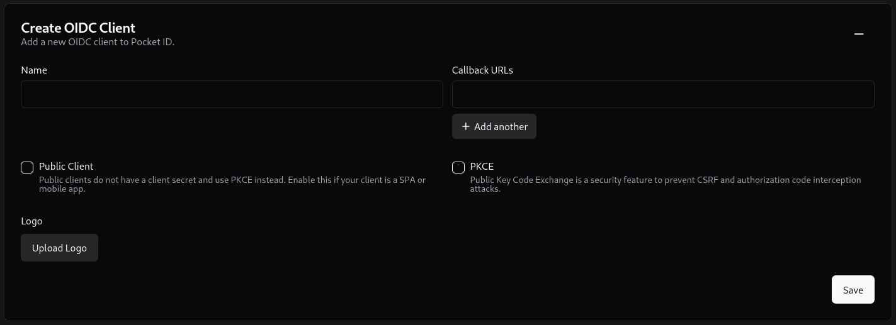
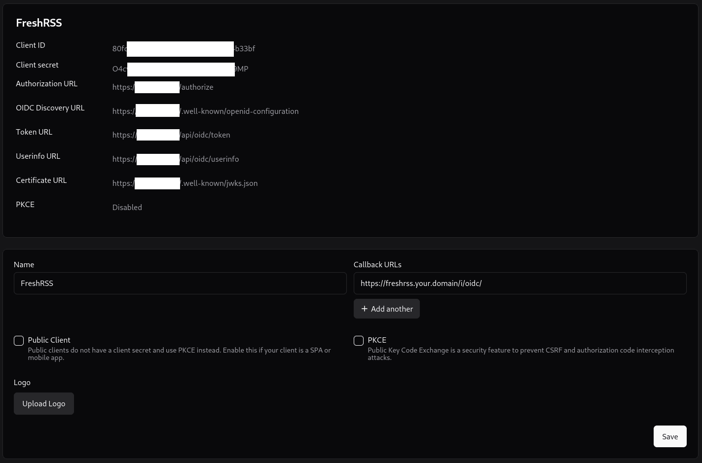

# Setting up Pocket ID for FreshRSS

**[Pocket ID](https://github.com/stonith404/pocket-id)** is a simple OIDC provider that allows users to authenticate with their passkeys to your services.
(See [FreshRSS’ OpenID Connect documentation](16_OpenID-Connect.md)).

You can find more information in the [Pocket ID documentation](https://docs.pocket-id.org/introduction).

## 1. Create OAuth2/OpenID Provider

Click on **Add OIDC Client** in the Pocket ID Web UI:



Give the client a name. Under callback URLs, put the URL for your FreshRSS instance as such:
`https://freshrss.your.domain/i/oidc/`.
(Optional) Upload a logo for the client. Click Save.

OIDC credentials for the client will be generated. Click *Show more details* to view all generated fields.
Keep this window open as these values will now need to be copied into your Docker Compose file for FreshRSS.



## Step 2. Configure FreshRSS’ environment variables

### Docker Compose

This is an example docker-compose file for FreshRSS with OIDC enabled.

```yaml
services:
  freshrss:
    image: freshrss/freshrss:1.25.0
    container_name: freshrss
    ports:
      - 8080:80
    volumes:
      - /freshrss_data:/var/www/FreshRSS/data
      - /freshrss_extensions:/var/www/FreshRSS/extensions
    environment:
      CRON_MIN: 1,31
      TZ: Etc/UTC
      OIDC_ENABLED: 1
      OIDC_CLIENT_ID: <POCKET_ID_CLIENT_ID>
      OIDC_CLIENT_SECRET: <POCKET_ID_SECRET>
      OIDC_PROVIDER_METADATA_URL: https://pocketid.your.domain/.well-known/openid-configuration
      OIDC_SCOPES: openid email profile
      OIDC_X_FORWARDED_HEADERS: X-Forwarded-Proto X-Forwarded-Host
      OIDC_REMOTE_USER_CLAIM: preferred_username
    restart: unless-stopped
    networks:
      - freshrss
networks:
  freshrss:
    name: freshrss
```

> ℹ️ The Username used in Pocket ID must match the Username used in FreshRSS **exactly**. This also applies to case sensitivity.
As of version `0.24` of Pocket ID all Usernames are required to be entirely lowercase. FreshRSS allows for uppercase.
If a Pocket ID Username is `amanda` and your FreshRSS Username is `Amanda`, you will get a 403 error in FreshRSS and be unable to login.
As of version `1.25` of FreshRSS, it is not possible to change your username in the GUI.

## Step 3. Complete OIDC Setup

Back in your Pocket ID window, once your Pocket ID credentials are copied over, click *Save*.

If you are setting up a new instance of FreshRSS, simply start the container with the OIDC variables and navigate to your FreshRSS URL.
If you are adding OIDC to an existing FreshRSS instance, recreate the container with the docker-compose file with the OIDC variables in it and navigate to your FreshRSS URL.

See [FreshRSS’ OpenID Connect documentation](16_OpenID-Connect.md) for more information.
